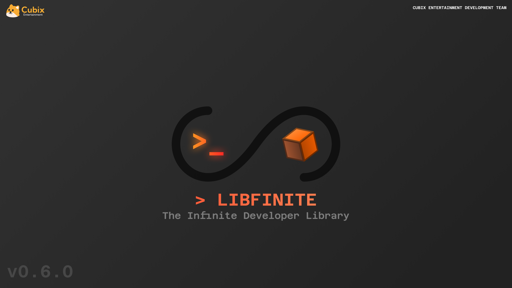

# Infinite SDK

<div class="alert alert-info part text-info">
❓ Documentation for <b>v0.6.0</b>
</div>

Welcome to the Infinite Developer Family! I'm so glad you or your project manager has decided to bring your project to Infinite. This documenation page will provide some information on how to use the Infinite API and how to build an Infinite Compliant game.


## Project Goals

The objective of Infinite Library is to create an abstractable, simple and lightweight development library for Infinite Game Developers that handles the complexities of interacting with the console behind simple, easy to understand functions while still giving developers freedom of choice to implement their own versions of these functions.

As a developer, you can easily mix and match the implementation of features provided by the Infinite SDK and your own implementations to create a virtually seamless transition to the Infinite hardware.


## Getting Started

<div class="alert alert-info part text-info">
❓ The Infinite Library is intended to be used on a Linux based system.
</div>

###  Prerequisites

🔸 [cglm](https://github.com/recp/cglm) - A C based Graphics Math library<br>
🔸 [Wayland](https://gitlab.freedesktop.org/wayland/wayland) - The window compositing protocol.<br>
🔸 [Wayland Protocols](https://gitlab.freedesktop.org/wayland/wayland-protocols) - Additional Non Standard features for Wayland. (v1.24 or higher)<br>
🔸 [Cairo](https://cairographics.org/) - Graphics Library for drawing data to buffers.<br>
🔸 [Vulkan](https://github.com/KhronosGroup/Vulkan-Loader/) - An explicit graphical libary that gives users the full control over the rendering process.<br>
🔸 [xkbcommon](https://github.com/xkbcommon/libxkbcommon) - Keymap library.<br>
🔸 [libevdev](https://www.freedesktop.org/wiki/Software/libevdev/) - evdev device library<br>
🔸 [sndfile](https://github.com/libsndfile/libsndfile) - C library for reading and writing audio data<br>
🔸 [ALSA](https://www.alsa-project.org/wiki/Main_Page) - The Advanced Linux Sound Architecture<br>
🔸 [Meson](https://github.com/mesonbuild/meson) - The Meson Build System

### 🚧 Building

```bash
meson setup build --prefix=/usr
ninja -C build install
```

## 🔥 Code Examples

The repository contains several example projects that can help you get adjusted to the Infinite Library.


## 📖 License

This project is intended to be open source to members of the Infinite Developer Environment. As a developer for Infinite Hardware you are free to edit, change or otherwise modify this project with the intention of contributing to the improve of the Infinte Developer tools. You may **not** however redistribute or resell any version of this project without the express written consent of Cubix Entertainment LLC.

© Cubix Entertainment 2025. Cubi and the Cubix Logo are trademarks of Cubix Entertainment LLC.